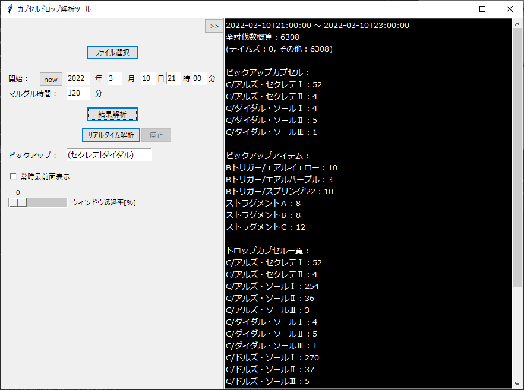

# CapsuleDropAnalyzer

* 利用は自己責任でお願いします

## 環境

* windows10での動作のみ確認

## ダウンロード方法

以下URLからダウンロード

```
https://github.com/gitKTdev/PSO2NGS_tools/raw/main/CapsuleDropAnalyzer/dist/PSO2NGS_CapsuleDropAnalyzer.exe
```

## 使用方法

ダウンロードしたexeファイルを実行すると起動します

### 画面説明



* **ファイル選択**
  * 解析したいActionLogファイルを選択してください
  * ドキュメント\SEGA\PHANTASYSTARONLINE2\log_ngsにあります
* **開始**（日時入力）
  * 記録開始となる日時情報を入力してください
  * nowボタンをクリックすると現在の日時情報が記入されます
* **マルグル時間**（分単位）
  * 記録開始時間から何分間のデータを解析するか記入してください
* **結果解析**
  * 記録開始日時からマルグル時間経過したときのドロップ情報を解析し、右のテキストボックスに出力します
* **リアルタイム解析 & 停止**
  * 開始に記入された日時から現在までのドロップ情報をリアルタイム（毎秒）に解析し、右のテキストボックスに出力します
* **ピックアップ**
  * ピックアップしたいカプセル名を記入してください
    * 正規表現で記載することができます
      * 例）(アーム|セクレテ)
  * 右のテキストボックスの画面上部にピックアップカプセルが表示されるようになります
* **常時最前面表示**
  * ツール画面を常に最前面に表示させるかを選択することができます
* **ウィンドウ透過率**
  * ツール画面の透過率を指定することができます
* **>>**（右上のボタン）
  * 左側のパラメータ指定画面を畳むことができます
