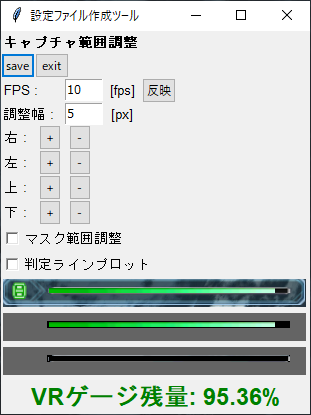
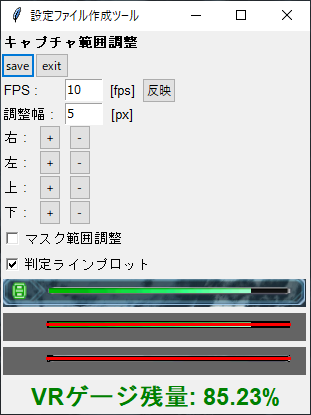

# VRGaugeManagementTool

* 利用は自己責任でお願いします

## 環境

* windows10での動作のみ確認

## ダウンロード方法

以下URLからダウンロード

```
https://github.com/gitKTdev/PSO2NGS_tools/raw/main/VRGaugeManagementTool/dist/PSO2NGS_VRGaugeManagementTool.exe
```

## 使用方法

ダウンロードしたexeファイルを実行すると起動します

### 画面説明



* **キャプチャ範囲調整**
  * **FPS**
    * キャプチャの時間間隔を変更可能 (デフォルト : 10fps)
    * 「反映」を押すと適用される
  * **調整幅**
    * キャプチャ範囲を調整する際の調整幅
    * 値が小さいほど細かい調整ができる
  * **右 (左, 上, 下)**
    * キャプチャする範囲を指定方向に拡張, 縮小する
  * **マスク位置調整**
    * 高精度でVRゲージを解析するため、「VRゲージバー抽出画面」「VRゲージバー枠抽出画面」の余分な部分をマスクする位置の調整
    * マスクはグレー部分になる
  * **判定ラインプロット**
    * ツールでVRゲージの計算に使用している判定ゾーンを「VRゲージバー抽出画面」「VRゲージバー枠抽出画面」にプロットする
    * 判定ロジック
      * 「VRゲージバー抽出画面」の判定ライン内にある緑色の長さを計測し, VRゲージ残量としている
      * 「VRゲージバー枠抽出画面」の判定ライン内にある黒ではない色間の長さを計測し, VRゲージ総量としている
    * サンプルイメージ
      * 
      * イメージ中の赤ラインが判定ライン
  * **save**
    * キャプチャ範囲調整で調整した値をローカルに保存し, 次回実行時に同じ調整内容で出力するためのファイルを作成する
    * ファイルはPSO2NGS_VRGaugeManagementTool.exeを配置しているフォルダに作成される
    * exeファイルと共に専用フォルダを作成し, exeファイルのショートカットをデスクトップに置くといった使用方法を推奨する

* **キャプチャ画面**
  * **「キャプチャ画面」**
    * 一番上のイメージ
    * 実際のゲーム画面からキャプチャしたイメージを出力
  * **「VRゲージバー抽出画面」**
    * キャプチャ画面からVRゲージのみを抽出したイメージを出力
    * VRゲージ残量
      * 「VRゲージ残量」の分子に値する
  * **「VRゲージバー枠抽出画面」**
    * キャプチャ画面からVRゲージの枠のみを抽出したイメージを出力
    * VRゲージ総量
      * 「VRゲージ残量」の分母に値する
  * **「VRゲージ残量」**
    * 算出されたVRゲージの残量をリアルタイムに出力
