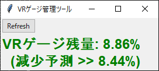

# VRGaugeManagementTool

* 利用は自己責任でお願いします

## 環境

* windows10での動作のみ確認

## ダウンロード方法

以下URLから2つダウンロード

```
https://github.com/gitKTdev/PSO2NGS_tools/raw/main/VRGaugeManagementTool/dist/PSO2NGS_VRGaugeManagementTool.exe
https://github.com/gitKTdev/PSO2NGS_tools/raw/main/VRGaugeManagementTool/dist/WindowCaptureController.exe
```

* ダウンロードしたexeファイルは必ず同じフォルダ内で管理すること

## 使用方法

ダウンロードしたexeファイルを実行すると起動します

### 画面説明

#### **PSO2NGS_VRGaugeManagementTool.exe**

* VRゲージの残量を解析するツール



* **Refresh**
  * ツールを再起動させるボタン
  * 画面が重くなった際に押してください

#### **PSO2NGS_VRGaugeManagementTool.exe**

* PSO2NGS_VRGaugeManagementTool.exeに必要なコンフィグファイルを作成するツール 
* 調整専用のツールであるため, ゲームプレイ中での長時間の使用は推奨しません 
* ゲームプレイ中ではPSO2NGS_VRGaugeManagementTool.exeを使用してください


* **キャプチャ範囲調整**
  * **save**
    * キャプチャ範囲調整で調整した値をローカルに保存し, 次回実行時に同じ調整内容で出力するためのファイルを作成する
    * ファイルはPSO2NGS_VRGaugeManagementTool.exeを配置しているフォルダに作成される
    * ファイル名は"vrgmt_config.cfg"
    * 2つのexeファイルはどちらも同じコンフィグファイルを参照する
    * 専用フォルダを作成し, exeファイルのショートカットをデスクトップに置くといった使用方法を推奨する
  * **exit**
    * ツール終了ボタン
    * 設定完了&save後に押してツールを終了させてください
  * **FPS**
    * キャプチャの時間間隔を変更可能 (デフォルト : 10fps)
    * 「反映」を押すと適用される (save押下時も適用されるようになる)
  * **調整幅**
    * キャプチャ範囲を調整する際の調整幅
    * 値が小さいほど細かい調整ができる
  * **右 (左, 上, 下)**
    * キャプチャする範囲を指定方向に拡張, 縮小する
  * **マスク位置調整**
    * 高精度でVRゲージを解析するため、「VRゲージバー抽出画面」「VRゲージバー枠抽出画面」の余分な部分をマスクする位置の調整
    * マスクはグレー部分になる
  * **判定ラインプロット**
    * ツールでVRゲージの計算に使用している判定ゾーンを「VRゲージバー抽出画面」「VRゲージバー枠抽出画面」にプロットする
    * 判定ロジック
      * 「VRゲージバー抽出画面」の判定ライン内にある緑色の長さを計測し, VRゲージ残量としている
      * 「VRゲージバー枠抽出画面」の判定ライン内にある黒ではない色間の長さを計測し, VRゲージ総量としている
    * サンプルイメージ
      * 
      * イメージ中の赤ラインが判定ライン

* **キャプチャ画面**
  * **「キャプチャ画面」**
    * 一番上のイメージ
    * 実際のゲーム画面からキャプチャしたイメージを出力
  * **「VRゲージバー抽出画面」**
    * キャプチャ画面からVRゲージのみを抽出したイメージを出力
    * VRゲージ残量
      * 「VRゲージ残量」の分子に値する
  * **「VRゲージバー枠抽出画面」**
    * キャプチャ画面からVRゲージの枠のみを抽出したイメージを出力
    * VRゲージ総量
      * 「VRゲージ残量」の分母に値する
  * **「VRゲージ残量」**
    * 算出されたVRゲージの残量をリアルタイムに出力

## 注意点

* 本ツールはメモリリークの疑いがあります
* ライブラリ起因の問題であり, 個人の手におえないため, 重くなったら都度再起動をしてください
